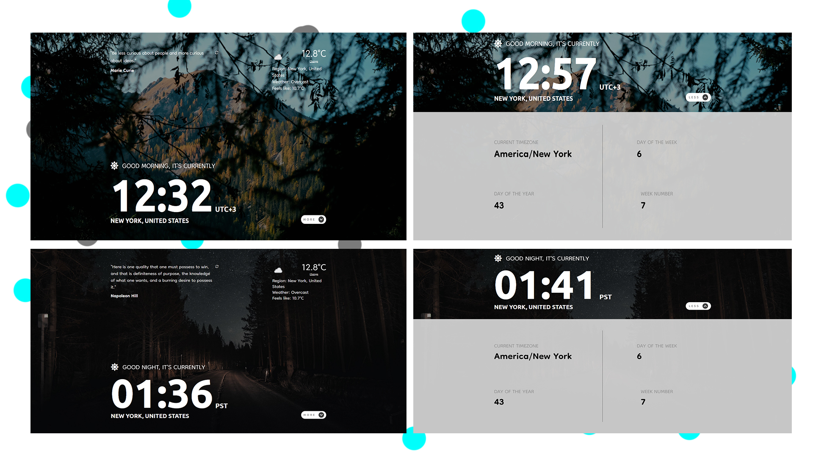
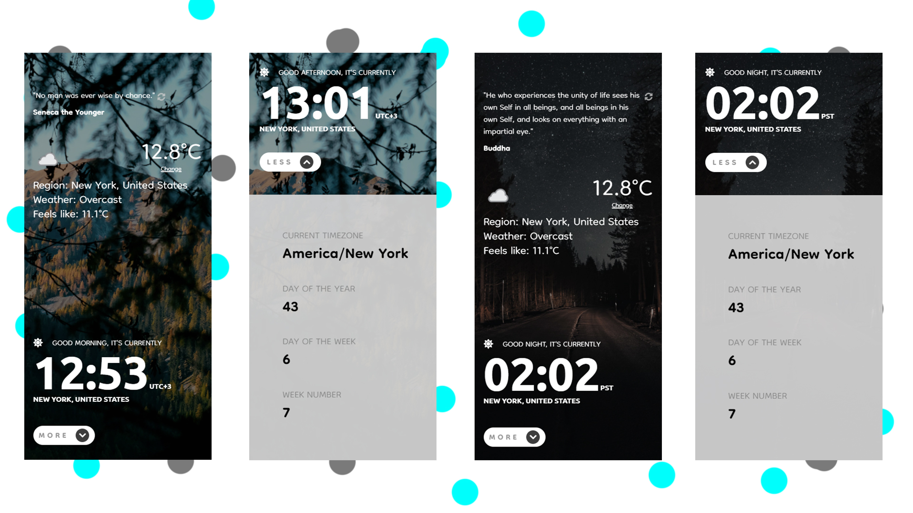

# Clock App

### Preview:

### Technologies used:

1. npm
1. eslint, prettier
1. parcel
1. HTML
1. SCSS
1. JavaScript
1. `moment-timezone` npm package
1. responsive design: desktop & tablet & mobile.

### API used:

1. Geolocation API
1. Weather API
